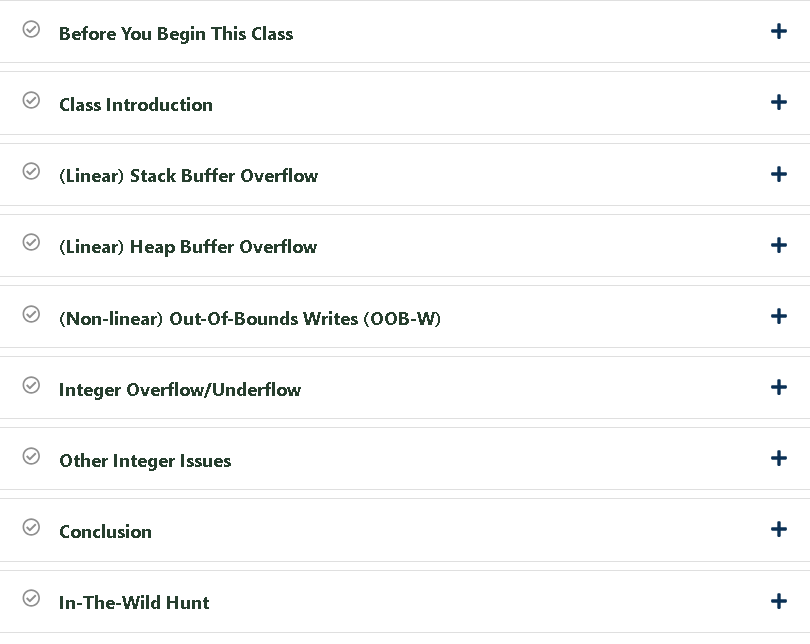
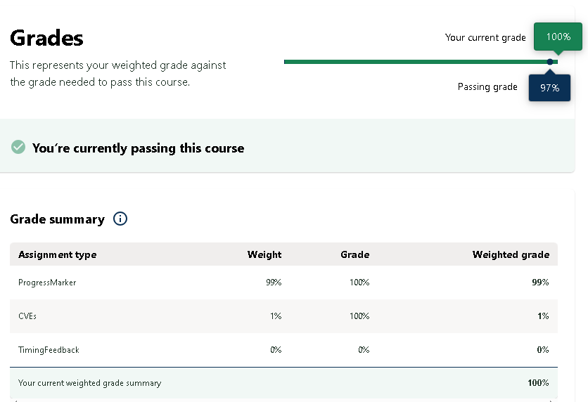

# 🛡️ Vulnerabilities 1001 – OpenSecurityTraining2

This repository documents what I learned from the **Vulnerabilities 1001: C-Family Software Implementation Vulnerabilities** course by [OpenSecurityTraining2](https://opensecuritytraining2.github.io/).  
It includes my personal notes, vulnerable C code, Python exploit scripts, and my completion certificate.

---

## 📜 Certificate

- 🏅 [Vulnerabilities 1001 – Completion Certificate](./cert/Vulnerabilities%201001C-Family%20Software%20Implementation%20Vulnerabilities.png)

---

## 📒 Topics Covered

- 🧠 Stack-based Buffer Overflows  
- 🧵 Format String Vulnerabilities  
- 🧱 Heap Exploitation  
- 🔢 Integer Overflows and Underflows  
- ☠️ Use-After-Free & Double Free  
- 🛡️ Bypassing Compiler Mitigations (Canaries, ASLR, DEP)

---

## 📸 Course Overview Screenshots

| Topic                         | Screenshot |
|------------------------------|------------|
| 📘 Certificate Overview       |  |
| 🧾 Grade Report               |  |

---

## 📂 Structure

| Folder        | Content |
|---------------|---------|
| `notes/`      | Markdown notes on each vulnerability class |
| `demo/`       | Vulnerable C code & exploit scripts |
| `cert/`       | Certificate of course completion |
| `screenshots/`| Screenshots from course or lab results |

---

## 🛠️ Sample Usage

```bash
# Compile a vulnerable binary (Stack Overflow)
gcc -fno-stack-protector -z execstack -no-pie -m32 demo/vuln-stack.c -o vuln-stack

# Launch exploit
python3 demo/exploit-stack.py
```

✅ Best run in a VM with protections disabled:

```bash
echo 0 | sudo tee /proc/sys/kernel/randomize_va_space
```
🔒 Security Warning
This repository is strictly for educational and research purposes.

## ⚠️ Never use unsafe functions like strcpy, sprintf, or printf(user_input) in real-world applications.

- They can introduce critical vulnerabilities like stack overflow or format string attacks.

## 🛡 Best practices:

- Use snprintf, strncpy, etc.

- Enable protections (stack canaries, ASLR, RELRO, PIE)

- Audit low-level C code for memory safety

## 📝 Course Review: Vulnerabilities 1001 – OpenSecurityTraining2

"Vulnerabilities 1001" is one of the most in-depth and technically rich courses on C-family software vulnerabilities. Here’s my brief personal review:

✅ What I Liked:

- Deep dive into how memory corruption works at the binary level

- Practical GDB debugging and exploit dev

- Clear progression from basic stack bugs to heap and format bugs

- Instructor Xeno Kovah is very detailed and structured

📌 What Could Be Improved:

- Could include more guided challenges per topic

- Some concepts may be too advanced for beginners without C/Linux background

## 🎓 Final Thoughts

- A must-take course for:

- Vulnerability Researchers

- Red Team Operators

- Anyone transitioning from Web to Binary exploitation

## 💡 Recommended for:

- Intermediate learners familiar with C/Linux and interested in exploit development.

✍️ Author

Thành Danh – Pentester & Cybersecurity Research

GitHub: @ngvtdanhh

Email: ngvu.thdanh@gmail.com

